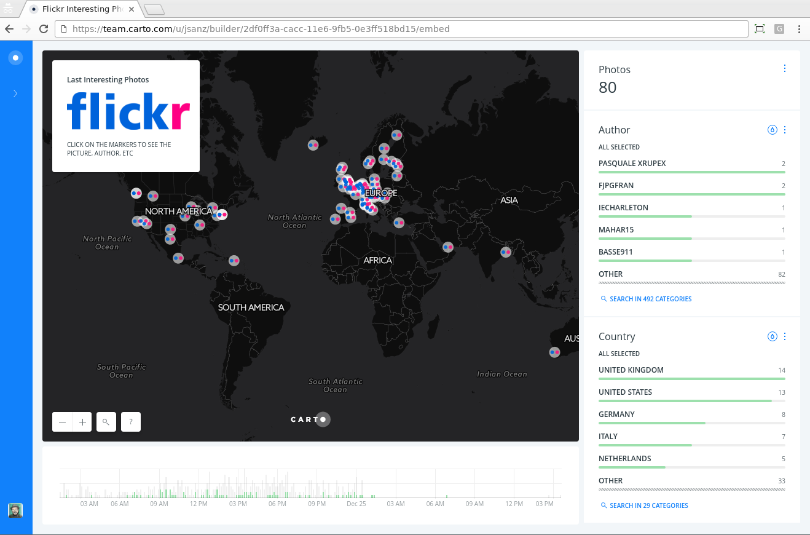

# carto-lambda-examples

Some examples of CARTO integrations using Lambda AWS. These examples are
implemented using [Zappa](https://www.zappa.io/) so it's quite straight forward
to deploy them on your own AWS account.

## Set up

Clone the repository, create a virtual environment, install the dependencies and
try `zappa -h` to check you have the tool-set installed.

```
$ virtualenv env
[...]
$ source env/bin/activate
(env)$ pip install -r requirements.txt
[...]
(env)$ zappa -h
usage: zappa [-h] [-v] [-a APP_FUNCTION] [-s SETTINGS_FILE]
             {certify,deploy,init,invoke,manage,rollback,schedule,status,tail,undeploy,unschedule,update}
             ...

Zappa - Deploy Python applications to AWS Lambda and API Gateway.
[...]
```

You also need of course an account on AWS and the `aws` command line tool with
an account configured, more details
[here](http://docs.aws.amazon.com/cli/latest/userguide/cli-chap-getting-set-
up.html).

## Proxy to convert into GeoJSON

[Source code](flickr_to_geojson.py) · [Blog post](https://geomaticblog.net/2016/12/26/creating-a-collaborative-photo-map-from-flickr-to-carto-with-amazon-lambda/)

This script converts responses from [Flickr API](https://www.flickr.com/services/api/)
to GeoJSON feature collections so you can feed them to CARTO as a Synchronized
Table or as a normal (one shot) upload. It's quite straight forward to read, just
go to the `@app.route...` line as the starting point and follow the procedure
to parse the parameters. Main logic for Flickr is at the `getPhotos` function.

If you want to run this script on your own account you need to register your own
Flickr application to get an API key and put into the `zappa_settings.json`
file. You can also configure the default name of the file that the end point
will put in the HTTP header. Then you only need to deploy it to AWS with:

```
(dev)$ zappa deploy dev
(python-dateutil 2.5.3 (.../carto-lambda-examples/env/lib/python2.7/site-packages), Requirement.parse('python-dateutil==2.6.0'), set([u'zappa']))
Calling deploy for environment dev..
Downloading and installing dependencies..
100%|█████████████████████████████████████████████████████████████████████████| 37/37 [00:12<00:00,  2.92pkg/s]
Packaging project as zip..
Uploading flickrtogeojson-dev-1482693879.zip (33.7MiB)..
100%|█████████████████████████████████████████████████████████████████████████| 35.3M/35.3M [01:04<00:00, 454KB/s]
Uploading flickrtogeojson-dev-template-1482693970.json (1.6KiB)..
100%|█████████████████████████████████████████████████████████████████████████| 1.60K/1.60K [00:00<00:00, 6.40KB/s]
Waiting for stack flickrtogeojson-dev to create (this can take a bit)..
 75%|██████████████████████████████████████▎                                  | 3/4 [00:13<00:04,  4.94s/res]
Deploying API Gateway..
Deployment complete!: https://you-api-entrypoint.amazonaws.com/dev
```

**NOTE**: You may need to tweak the configuration file if you are using different
profiles on your AWS credentials, want to deploy in other zones, etc. Check
the [Advanced settings](https://github.com/Miserlou/Zappa#advanced-settings)
section of the official documentation.

This will create the Lambda function and the API Gateway entry and will give you
a URL of your API end point, say `https://you-api-entrypoint.amazonaws.com/dev`.
If you go to that url without any parameters it will download a GeoJSON file
from the [Project Weather](https://www.flickr.com/groups/projectweather/) Flickr
Group with the last five entries.

From this point you can use this endpoint as a proxy to any
[Flickr API](https://www.flickr.com/services/api/) request that retrieves photos. You'll
need to provide the same parameters that the method you are using. If you don't
provide a `extras` parameter sensible defaults will be used.

### Usage

The URL for the entry point has been exported as `FLICKR2GEOJSON` for convenience.

Retrieve the last 10 photos of the [Your Best Shot 2016](https://www.flickr.com/groups/yourbestshot2016)
group using the method
[`flickr.groups.pools.getPhotos`](https://www.flickr.com/services/api/flickr.gro
ups.pools.getPhotos.html):

```
$ curl -s "$FLICKR2GEOJSON??method=flickr.groups.pools.getPhotos&group_id=1546513@N25&per_page=10&file_name=flickr_foss4g" \
| jq ".features[].properties.title"

"Καινούριους τόπους δεν θα βρεις, δεν θά βρεις άλλες θάλασσες. Η πόλις θα σε ακολουθεί. Στους δρόμους θα γυρνάς τους ίδιους.."
"More the Merrier"
"kyoto."
"Donald Trump street art in Copenhagen"
"sea shells in the morning light"
"Soirée Lightpainting"
"e-m1 16#009"
"Banhof - Berlin"
"Hide And Seek"
"_DESVAN_bn"
```

Retrieve the last 100 most interesting pictures using the method
[`flickr.interestingness.getList`](https://www.flickr.com/services/api/flickr.interestingness.getList.html):

```
curl -s "$FLICKR2GEOJSON??method=flickr.interestingness.getList&per_page=100&file_name=flickr_interesting" \
> interesting.geojson
```

### Application with CARTO

Using the last example you can define a CARTO Sync Table that will update every
day with the last 500 images. Of course only a number of them have coordinates
so every day the map will have a different number of photos.

https://team.carto.com/u/jsanz/builder/2df0ff3a-cacc-11e6-9fb5-0e3ff518bd15/embed




## CARTO Engine SQL API scheduled task

Set up a scheduled event that performs a maintenance task on a CARTO table.

**TO DO**

## CARTO Engine Proxy

A proxy to allow some operations for anonymous users that would need an API key.

**TO DO**

## Listen a push API

Listen to Foursquare push API calls for real time maintenance of a CARTO
checkins table.

**TO DO**
